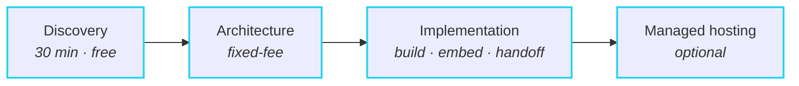

<picture>
  <source media="(prefers-color-scheme: dark)" srcset="assets/hero-dark.svg">
  
</picture>

Founder of [**Cubite**](https://cubite.io) — the LMS born from 50+ Open edX, Moodle & Canvas deployments and 400K learners reached.

<picture><source media="(prefers-color-scheme: dark)" srcset="assets/divider-dark.svg"></picture>

## What I build

<table>
<tr>
<td width="33%" valign="top">

**PRODUCT**

### Cubite
The LMS I built after 13 years of seeing what the others get wrong.

**Designed to be used, not survived.** After years inside clients' Moodle and Open edX deployments I kept hearing the same complaints: dated UI, too many clicks for basic tasks, a plugin for every feature, and a team of integrators just to install it. Cubite inverts every one:

- Beautiful, modern UI — usable on day one
- Fast workflows — fewer clicks per task
- SSO, MFA, payments, AI, storefront built-in — no plugin sprawl
- Managed hosting — no DevOps team needed
- Multi-tenant, white-label, AI-native course generation

[**cubite.io →**](https://cubite.io)

</td>
<td width="33%" valign="top">

**SERVICES**

### Open edX & Moodle
13 years of production experience.

Custom XBlocks, Moodle plugins, Tutor-based hosting, MFE customization, edx-platform overrides, theming, SSO, and zero-downtime platform migrations.

[**Get in touch →**](mailto:amir@cubite.io)

</td>
<td width="33%" valign="top">

**INTEGRATIONS**

### Canvas LTI
LTI 1.3 / LTI Advantage tool development for Canvas, Moodle, and Brightspace.

Deep Linking 2.0, Assignment & Grade Services (AGS), Names & Roles Provisioning Service (NRPS), and Dynamic Registration.

[**Get in touch →**](mailto:amir@cubite.io)

</td>
</tr>
</table>

<picture><source media="(prefers-color-scheme: dark)" srcset="assets/divider-dark.svg"></picture>

## Selected clients

<picture>
  <source media="(prefers-color-scheme: dark)" srcset="assets/logos-dark.svg">
  
</picture>

<picture><source media="(prefers-color-scheme: dark)" srcset="assets/divider-dark.svg"></picture>

## What people say

> ### "One of the most thoughtful, focused engineers on my team."
>
> **Aaron Beals** — Product-oriented Technical Leader

> ### "A key driving force behind everything happening technically with our enterprise customers."
>
> **Valerie Pierre** — Innovation & Digital Education Specialist

<picture><source media="(prefers-color-scheme: dark)" srcset="assets/divider-dark.svg"></picture>

## How I work

1. **Discovery call** — what you're building, what you've tried, what's broken.
2. **Architecture review** — concrete plan: stack, infra, integration points, risks, timeline. You own the document either way.
3. **Implementation** — I build it with you, embed with your team, or hand off to your engineers. Custom XBlocks, Moodle plugins, LTI tools, platform migrations, or a Cubite white-label deployment.
4. **Managed hosting** — Cubite-managed infra with scaling, SLA, and zero-touch upgrades.

> [!TIP]
> **Best fit for**
> - Teams running Moodle or Open edX who've outgrown the off-the-shelf experience.
> - SaaS companies shipping a Canvas / Moodle / Brightspace LTI integration who don't want to learn the spec from scratch.
> - Enterprises and universities migrating between platforms with zero downtime and zero data loss.
> - Founders evaluating "build vs. buy vs. white-label" for an LMS-shaped product.

<picture><source media="(prefers-color-scheme: dark)" srcset="assets/divider-dark.svg"></picture>

### Building an LMS, integrating with one, or migrating off one?

