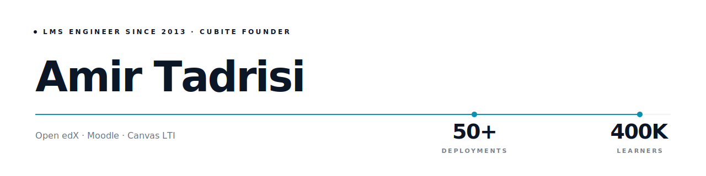
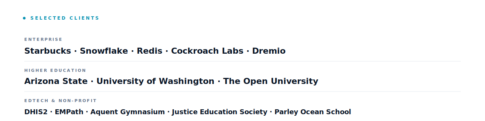
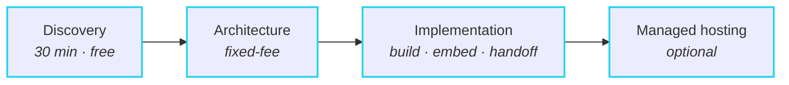

<picture>
  <source media="(prefers-color-scheme: dark)" srcset="assets/hero-dark.svg">
  
</picture>

<picture><source media="(prefers-color-scheme: dark)" srcset="assets/divider-dark.svg"></picture>

## What I build

### Cubite — Custom LMS Platform

[Cubite](https://cubite.io) is the LMS I built after 13 years inside Moodle and Open edX deployments. **Designed to be used, not survived.**

- Modern UI · fast workflows · usable on day one
- SSO, MFA, payments, AI, storefront built-in — no plugin sprawl
- Multi-tenant · white-label · managed hosting

### vidbuilder.ai — AI Video Generation for Education

[vidbuilder.ai](https://vidbuilder.ai) generates AI video for education and LMS platforms — programmatic video from JSON, powered by Remotion.

### Open edX & Moodle Implementation Services

Custom XBlocks, Moodle plugins, Tutor-based hosting, MFE customization, edx-platform overrides, theming, SSO, and zero-downtime platform migrations.

### LTI Tool Development

LTI 1.3 / LTI Advantage tools for Canvas, Moodle, and Brightspace — Deep Linking 2.0, AGS, NRPS, and Dynamic Registration. For LMS or LTI work — reach me at [amir@cubite.io](mailto:amir@cubite.io).

<picture><source media="(prefers-color-scheme: dark)" srcset="assets/divider-dark.svg"></picture>

## Selected clients

<picture>
  <source media="(prefers-color-scheme: dark)" srcset="assets/logos-dark.svg">
  
</picture>

<picture><source media="(prefers-color-scheme: dark)" srcset="assets/divider-dark.svg"></picture>

## What people say

> ### "One of the most thoughtful, focused engineers on my team."
>
> **Aaron Beals** — Product-oriented Technical Leader

> ### "A key driving force behind everything happening technically with our enterprise customers."
>
> **Valerie Pierre** — Innovation & Digital Education Specialist

<picture><source media="(prefers-color-scheme: dark)" srcset="assets/divider-dark.svg"></picture>

## How I work

1. **Discovery call** — what you're building, what you've tried, what's broken.
2. **Architecture review** — concrete plan: stack, infra, integration points, risks, timeline. You own the document either way.
3. **Implementation** — I build it with you, embed with your team, or hand off to your engineers. Custom XBlocks, Moodle plugins, LTI tools, platform migrations, or a Cubite white-label deployment.
4. **Managed hosting** — Cubite-managed infra with scaling, SLA, and zero-touch upgrades.

> [!TIP]
> **Best fit for**
> - Teams running Moodle or Open edX who've outgrown the off-the-shelf experience.
> - SaaS companies shipping a Canvas / Moodle / Brightspace LTI integration who don't want to learn the spec from scratch.
> - Enterprises and universities migrating between platforms with zero downtime and zero data loss.
> - Founders evaluating "build vs. buy vs. white-label" for an LMS-shaped product.

<picture><source media="(prefers-color-scheme: dark)" srcset="assets/divider-dark.svg"></picture>

### Building an LMS, integrating with one, or migrating off one?

