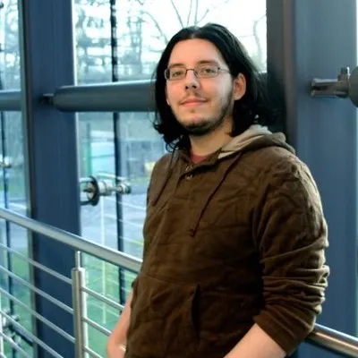

<picture>
  <source media="(prefers-color-scheme: dark)" srcset="assets/hero-dark.svg">
  
</picture>

<picture><source media="(prefers-color-scheme: dark)" srcset="assets/divider-dark.svg"></picture>

## What I build

### Cubite — Custom LMS Platform

[Cubite](https://cubite.io) is the LMS I built after 13 years inside Moodle and Open edX deployments. **Designed to be used, not survived.**

- Modern UI · fast workflows · usable on day one
- SSO, MFA, payments, AI, storefront built-in — no plugin sprawl
- Multi-tenant · white-label · managed hosting

### vidbuilder.ai — AI Video Generation for Education

[vidbuilder.ai](https://vidbuilder.ai) generates AI video for education and LMS platforms — programmatic video from JSON, powered by Remotion.

### Open edX & Moodle Implementation Services

Custom XBlocks, Moodle plugins, Tutor-based hosting, MFE customization, edx-platform overrides, theming, SSO, and zero-downtime platform migrations.

### LTI Tool Development

LTI 1.3 / LTI Advantage tools for Canvas, Moodle, and Brightspace — Deep Linking 2.0, AGS, NRPS, and Dynamic Registration. For LMS or LTI work — reach me at [amir@cubite.io](mailto:amir@cubite.io).

<picture><source media="(prefers-color-scheme: dark)" srcset="assets/divider-dark.svg"></picture>

## Selected clients

<picture>
  <source media="(prefers-color-scheme: dark)" srcset="assets/logos-dark.svg">
  
</picture>

<picture><source media="(prefers-color-scheme: dark)" srcset="assets/divider-dark.svg"></picture>

## What people say

<table>
<tr>
<td width="120" valign="middle">

</td>
<td valign="middle">

### "One of the most thoughtful, focused engineers on my team."

**Aaron Beals** — Product-oriented Technical Leader

</td>
</tr>
</table>

<table>
<tr>
<td width="120" valign="middle">

</td>
<td valign="middle">

### "Always blown away by how quickly and professionally Amir handled our issues."

**Colum Andrew McKenna** — Product Development Manager at The Open University

</td>
</tr>
</table>

<table>
<tr>
<td width="120" valign="middle">

</td>
<td valign="middle">

### "Literally no challenge that I have ever seen him fail to absolutely smash out of the park."

**Matthew Harrington** — Product Manager at Cambridge Spark

</td>
</tr>
</table>
